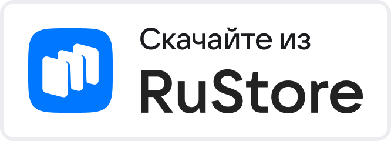
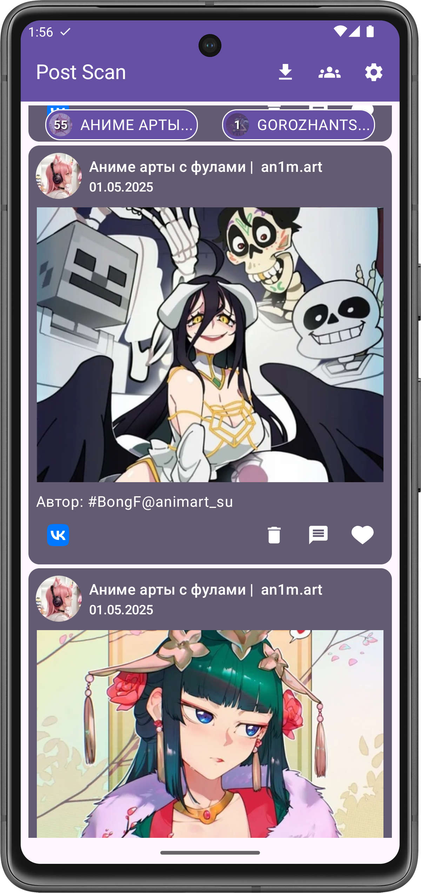
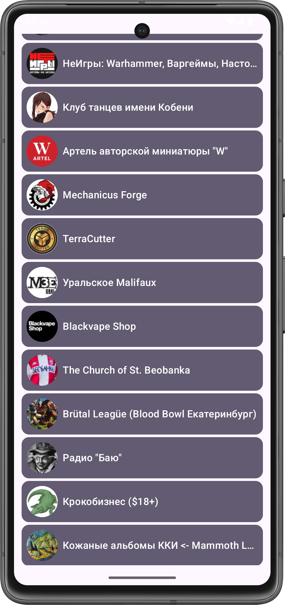
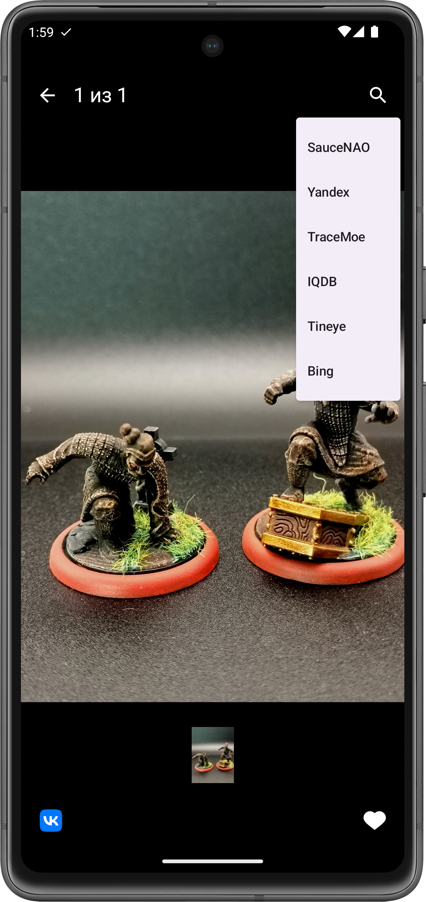

# PostScan 📬🔍

**PostScan** — это приложение Android для выгрузки постов VK для последующей обработки, сохранения и поиска связанных объектов.

  
  
  

## 🚀 Возможности
- 🔍 Поиск постов среди групп VK: подписок или любых других найденных групп 
- ⚙️ Выгрузка данных за период
- 📊 Выгрузка обновлений групп  
- 🔄 Интеграция с сервисами поиска по картинке
- 📑 Интеграция с приложением Mihon
- 🔤 Поддержка русского и английского языка

## 🛠 Установка
1. Скачайте и установите .apk файл

## 📌 Использование
1. Залогиньтесь используя API VK 
2. Выберите нужные группы для выгрузки
3. Нажмите на загрузку постов

## 🧰 Технологический стек
- Kotlin, Android SDK
- Jetpack Compose для UI
- Clean Architecture, MVI
- Coroutines и Flow для асинхронности и реактивности
- Retrofit для сетевых запросов к VK API
- Koin для внедрения зависимостей
- Room для локального хранения данных
- Coil для загурзки картинок
- Tiamat - навигация
- Firebase, Mock, JUnit, Splash screen API, Pager

## 🤝 Вклад
Мы приветствуем участие в разработке! Вы можете:
- Создавать **issue** с багами и предложениями.
- Отправлять **pull request** с улучшениями.
- Помогать с **документацией**.

## ⚙️ Сборка
Если вы хотите собрать свой .apk файл:
- Создайте приложение в сервисе VK ID - укажите название пакета ru.nyxsed.postscan и сгенерируйте хэш
- в файле `PostScan\build.gradle.kts` укажите параметры приложения `vkidRedirectScheme` и `vkidClientId`
- Добавьте в файл `local.properties` секретный ключ приложения VK ID `VKID_CLIENT_SECRET=`

## 📄 Лицензия
Проект распространяется под лицензией MIT. Подробнее см. в [LICENSE](LICENSE).

## 💬 Обратная связь
Если у вас есть вопросы или предложения, создавайте issue или свяжитесь со мной:
- GitHub: [Nyxsed](https://github.com/Nyxsed)